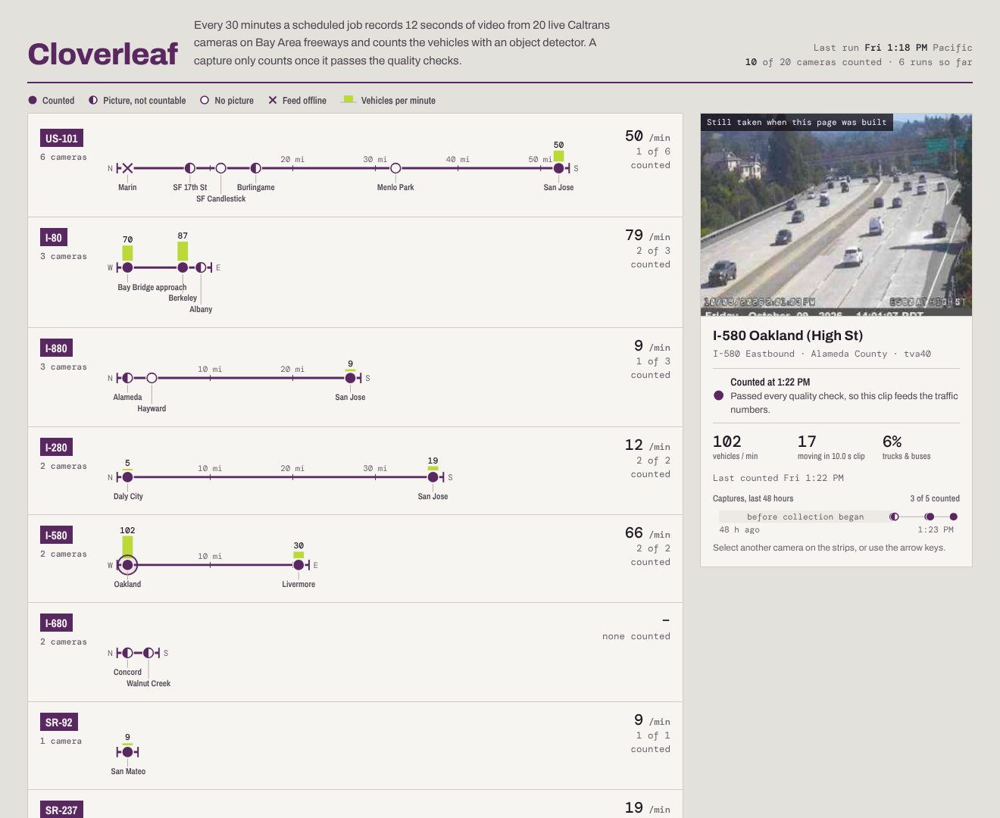

# Cloverleaf

**Bay Area freeway traffic, counted from live Caltrans cameras.** Every 30 minutes a GitHub Actions job opens 20 Caltrans District 4 camera streams, records 12 seconds from each, and counts and tracks vehicles with YOLOv8s and ByteTrack. Each capture is checked against quality rules before it counts. dbt turns the captures and National Weather Service observations into corridor flow, congestion, truck share and data-quality KPIs, on DuckDB or Snowflake. The page draws each freeway as a route strip map with the cameras placed along it.



It combines three things in one product: a scheduled data pipeline, a KPI dashboard, and a computer-vision app. The data is public and fails in real ways. Cameras go dark at night, Caltrans takes feeds offline, streams stall, and GitHub skips scheduled runs. The project's job is to say which numbers can be trusted.

## What the first day showed (Oct 9 2026)

- **Collection:** 6 runs and 111 captures. Only 38 passed every check. The main reasons captures were excluded:
  - darkness: 33
  - black or "No video" frames: 23
  - stalled streams: 10
  - offline or unreadable feeds: 7
- **Scheduling:** GitHub fired only 23% of the scheduled half-hourly runs that day. The sister project [Cloverfield](https://github.com/evannwilsonn/cloverfield) monitors this.
- **Daylight accuracy:** checked on 23 hand-counted frames (312 vehicles). The detector found 87% of them, and the average miss per frame was 22%. That passes the gate. The weak spot is dense queues: one frame with 41 queued vehicles under a bridge got 15.
- **Night accuracy:** checked on 13 frames. The detector found 26% of the vehicles. That is why dark captures are kept and labelled but never counted.

## How a capture becomes a number

1. **Collect** (`collector/capture.py`). OpenCV reads the HLS stream at 3 frames a second for 12 seconds. YOLOv8s detects vehicles and ByteTrack follows them, so a vehicle is counted once as it moves through the view. Each capture also records:
   - brightness, contrast, sharpness and motion
   - sun elevation
   - the GitHub run id

   Output goes as JSON lines to the `data` branch, together with NWS observations from the nearest station.
2. **Check** (`int_captures__checked`). The rules in `seeds/qc_rules.csv` run in priority order, and each capture is labelled by the first rule it fails:
   - feed offline
   - video unreadable
   - clip too short
   - no signal (black frame or Caltrans' flat "No video" card)
   - frozen feed
   - low light
   - blurred or obstructed

   All thresholds are dbt vars.
3. **Model.** Data moves through staging → intermediate → core (`fct_captures`, `fct_collection_runs`, `dim_cameras`) → reporting marts. The marts cover KPIs, corridors, hourly profile, camera status, data quality, weather impact, detection accuracy and the network timeline. There are 42 dbt tests.
4. **Check the detector** (`eval/`). Frames saved by the collector are counted by hand into `seeds/eval_labels.csv`. `eval/predict_frames.py` runs the detector on the same frames with the collector's settings. On busy frames the far traffic can't be counted reliably by hand, so `count_zone_top` limits both the person and the detector to the near part of the picture. `rpt_detection_accuracy` splits the results by daylight and dark. The build fails unless the detector finds at least 80% of daylight vehicles and its average miss per frame stays under 25%.
5. **Publish.** `dashboard/export_data.py` exports the marts, the last 48 hours of captures, and a current still per camera into one static page.

## Run it

```
pip install -r requirements.txt            # add requirements-collect.txt to run the collector
make collect                               # one clip per camera (what the 30-minute job runs)
make all                                   # sync the data branch, load DuckDB, dbt build, export
make serve                                 # http://localhost:8000
```

On Snowflake (key-pair sign-in, database `CLOVERLEAF`). Verified Oct 9 2026: 111 captures, 5,892 weather observations and 36 eval predictions loaded, all 64 dbt nodes pass.

```
python ingest/load_snowflake.py --duckdb warehouse/cloverleaf.duckdb --database CLOVERLEAF --schemas raw_cloverleaf
dbt build --profiles-dir . --target snowflake
python dashboard/export_data.py --target snowflake
```

## Scheduled jobs

- **`collect.yml`** runs every 30 minutes and appends captures and weather to the `data` branch.
- **`daily.yml`** runs at 05:10 Pacific. It loads everything, runs dbt, keeps `run_results.json` for Cloverfield, and publishes the page to GitHub Pages when the repository variable `PAGES_ENABLED` is `true`. It uses Snowflake when the secrets `SNOWFLAKE_ACCOUNT`, `SNOWFLAKE_USER` and `SNOWFLAKE_PRIVATE_KEY` exist, and DuckDB otherwise.

## Limits

- **Short history.** Collection started on Oct 9 2026, so the hourly profile and weather effects are early readings, not findings.
- **Speed index.** It comes from tracked pixel motion relative to each camera's own normal. It is not calibrated to miles per hour.
- **Positions.** Camera positions along each strip are measured from coordinates. They are not Caltrans postmiles.
- **Stills.** Camera images © Caltrans, used for display.
